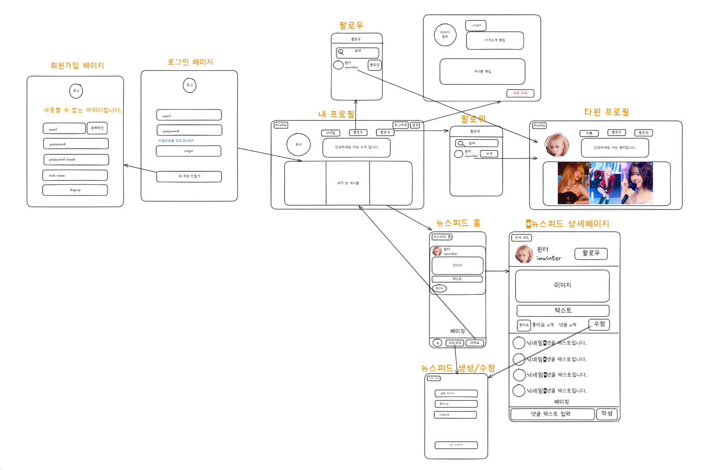

# spartagram

## 👥 Team Members

|                      이용환                       |                                        최혁                                        |                                       오동원                                        |
|:----------------------------------------------:|:--------------------------------------------------------------------------------:|:--------------------------------------------------------------------------------:|
|                    |  |  |
| [@YongLeeCode](https://github.com/YongLeeCode) |                  [@wannabeing](https://github.com/wannabeing)                  |                    [@pokerbearkr](https://github.com/pokerbearkr)                    |

|                                        이희망                                        |             박선영             |
|:---------------------------------------------------------------------------------:|:---------------------------:|
|  |  |
|                     [@HeeMang-Lee](https://github.com/HeeMang-Lee)                     |            [@Tcimel](https://github.com/Tcimel)            |

---

## 🛠 사용 기술 (Tech Stack)

| 분류 | 기술 |
|------|------|
| **Language** | Java 17 |
| **Framework** | Spring Boot 3.1.5 |
| **Build Tool** | Gradle |
| **Database** | H2 (개발용), MySQL (운영용) |
| **ORM** | Spring Data JPA |
| **Validation** | Jakarta Bean Validation (`@NotBlank`, `@Size` 등) |
| **Authentication** | JWT (jjwt, java-jwt) |
| **Dependency Management** | Spring Dependency Management Plugin |
| **Lombok** | Getter/Setter, Constructor, Builder 자동 생성 |
| **Test** | Spring Boot Starter Test (JUnit 기반) |
| **IDE** | IntelliJ IDEA (권장) |
| **협업 도구** | Notion, excalidraw, LucidChart 등 |

## 🤔 개발 순서
### 1. 브레인스톰
### 2. MVP 정의
### 3. Wireframe 설계
### 4. ERD 설계
### 5. API 명세서 구현

## 🔨 wireframe

## 🛴 ERD

## 💿 API 명세서
[API 명세서 자세히 보러 가기](https://www.notion.so/teamsparta/API-1ce2dc3ef51480e3a437f3ce956bb46c)