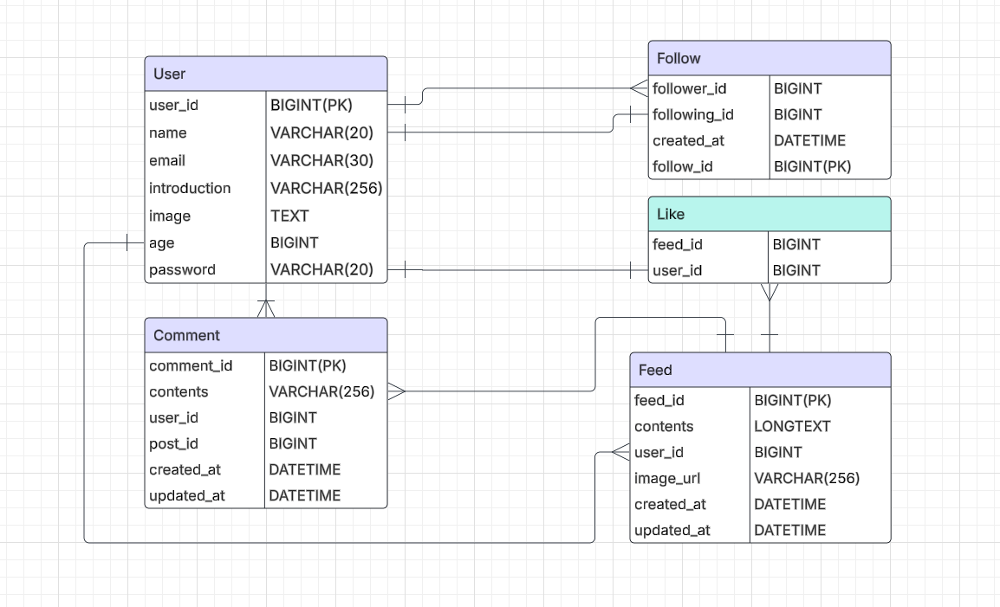

# New Speed 19(프로젝트 이름 수정 예정)

## 👥 Team Members

|                      이용환                       |              최혁              |             오동원              |
|:----------------------------------------------:|:----------------------------:|:----------------------------:|
|                    |  |  |
| [@YongLeeCode](https://github.com/YongLeeCode) |            [@]()             |            [@]()             |

|             이희망              |             박선영             |
|:----------------------------:|:---------------------------:|
|  |  |
|            [@]()             |            [@]()            |

## 🤔 개발 순서

### 1. 브레인스톰

### 2. MVP 정의

### 3. Wireframe 설계

### 4. ERD 설계

### 5. API 명세서 구현

### 6. 기능 구현

## 🔨 wireframe

## 🛴 ERD

[ERD 자세히 보러 가기](https://excalidraw.com/#json=oeQqHBN8GknAoSZThw_Wx,bOlhWvgsdfg-B11yczQ23Q)

## 💿 API 명세서

[API 명세서 자세히 보러 가기](https://www.notion.so/teamsparta/API-1ce2dc3ef51480e3a437f3ce956bb46c)

##